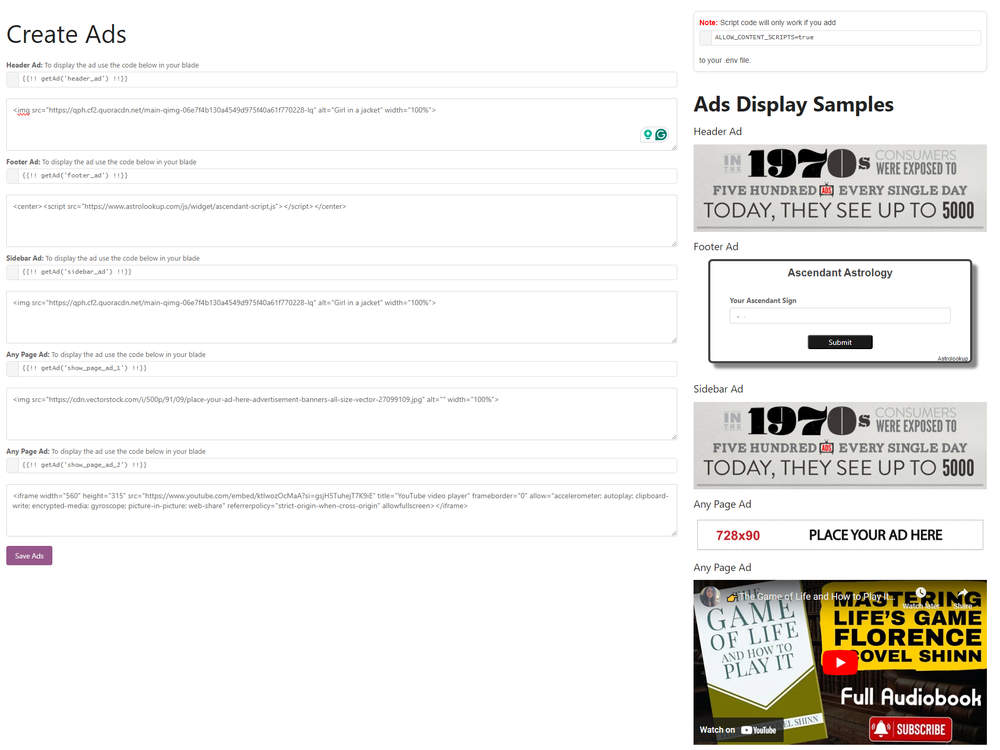

# Advertisement-Addon-for-BookStack
## Description
A Simple little addon to add advertisement to your BookStack based website. this is a addon for BookStack located at <a href="https://github.com/BookStackApp/BookStack"> BookStack Git </a>

Just sharing my little changes to my BookStack, anyone is welcome to improve it. use it as you want it. I got it for free, I give it for free with not limitations.

## Installation

## Step 1: Let's Upload the files first
Download the Zip Folder and upload the files following bookstack file structure,
## Step 2 Skip this if following Step 3
import the database ads.sql provided inside the zip folder (old Fashion way, I think its faster for me or you can do it the laravel way (I think it takes longer)

## Step 3: Skip this if following step  2
Skip this if you choose to import the sql file manually
Create a migration to store the ads in the database:
<pre><code>
php artisan make:migration create_ads_table	
</code></pre>
Then update the migration file (database/migrations/xxxx_xx_xx_xxxxxx_create_ads_table.php) as follows:

<pre><code>
use Illuminate\Database\Migrations\Migration;
use Illuminate\Database\Schema\Blueprint;
use Illuminate\Support\Facades\Schema;

class CreateAdsTable extends Migration
{
    public function up()
    {
        Schema::create('ads', function (Blueprint $table) {
            $table->id();
            $table->text('header_ad')->nullable();
            $table->text('footer_ad')->nullable();
            $table->text('sidebar_ad')->nullable();
            $table->text('show_page_ad_1')->nullable();
            $table->text('show_page_ad_2')->nullable();
            $table->timestamps();
        });
    }

    public function down()
    {
        Schema::dropIfExists('ads');
    }
}

	
</code></pre>
## Step 4
Run the migration:
<pre><code>
php artisan migrate

</code></pre>

## Step 5: Create helpers for the ad output tags
Exemple: You add the tags below to any of your blades to output the advertisement whereever you want in your site.
<pre><code>
{!! getAd('header_ad') !!}
{!! getAd('sidebar_ad') !!}
{!! getAd('show_ad_1') !!}
{!! getAd('show_ad_2') !!}
{!! getAd('footer_ad') !!}
	</code></pre>
 
Open Conposer.json and find 
<pre><code>
        "files": [
            "app/App/helpers.php",
			//Add this line "app/Ads/Helpers/AdHelper.php"
        ]
</code></pre>
## Step 6: Make sure only admin can visit the Create Ads page
Open App/Http/Kernel.php  and add

<pre><code>
protected $routeMiddleware = [
    // other middlewares
    'checkRole' => \BookStack\Http\Middleware\CheckRole::class,
];
</code></pre>
## Step 7: Adding Routes
Open Route/web.php and add
<pre><code>
use BookStack\Ads\Controllers\AdsController;
// Apply the middleware to the routes, checkRole:1 is admin only
Route::group(['middleware' => ['checkRole:1']], function() {
    Route::get('/ads/create-ads', [AdsController::class, 'createAds'])->name('ads.ads');
    Route::post('ads/store-ads', [AdsController::class, 'storeAds'])->name('ads.storeAds');
</code></pre>
## Step 8: Artisan Clear and Cache
Run 
<pre><code>
php artisan cache:clear
php artisan config:clear
php artisan view:clear
php artisan route:clear
php artisan route:cache
</code></pre>
## Step 9: Add link to menu
go to themes
resources/views/layouts/parts/header-links-start.blade.php
or 
themes/YourTheme/layouts/parts/header-links-start.blade.php 
and add the new menu 
 I did it like this

 Please replace the ? before the a href with < because I don't really know how to edit in github yet

<pre><code>
 
@if(!user()->isGuest() && userCan('users-manage') && !userCan('settings-manage'))
    ?a href="{{ url('/ads/create-ads') }}"
       data-shortcut="settings_view">@icon('users'){{ trans('settings.users') }}</a>
@endif
</code></pre>
## Step 10: Visit you site and happy advertising
visit your site https://yoursite.com/ads/create-ads and your will find more instructions there

I hope your enjoy, if you would like to donate for this work you can 

